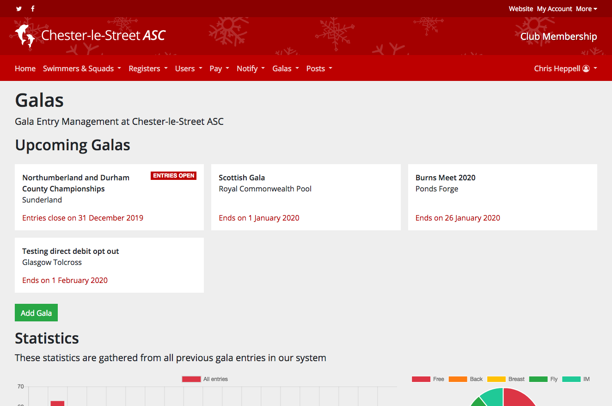
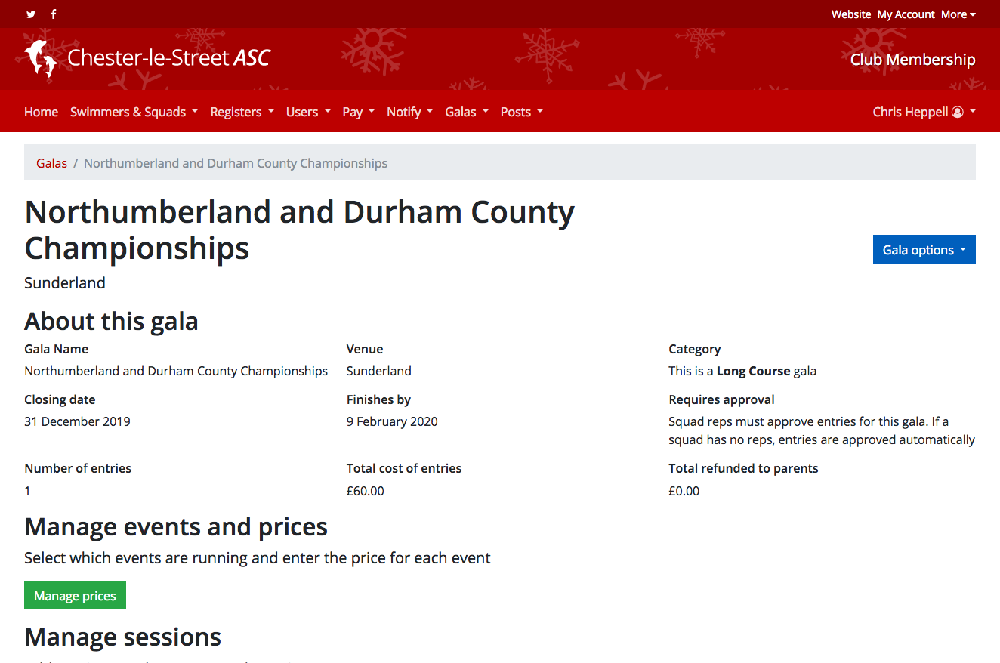
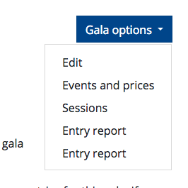
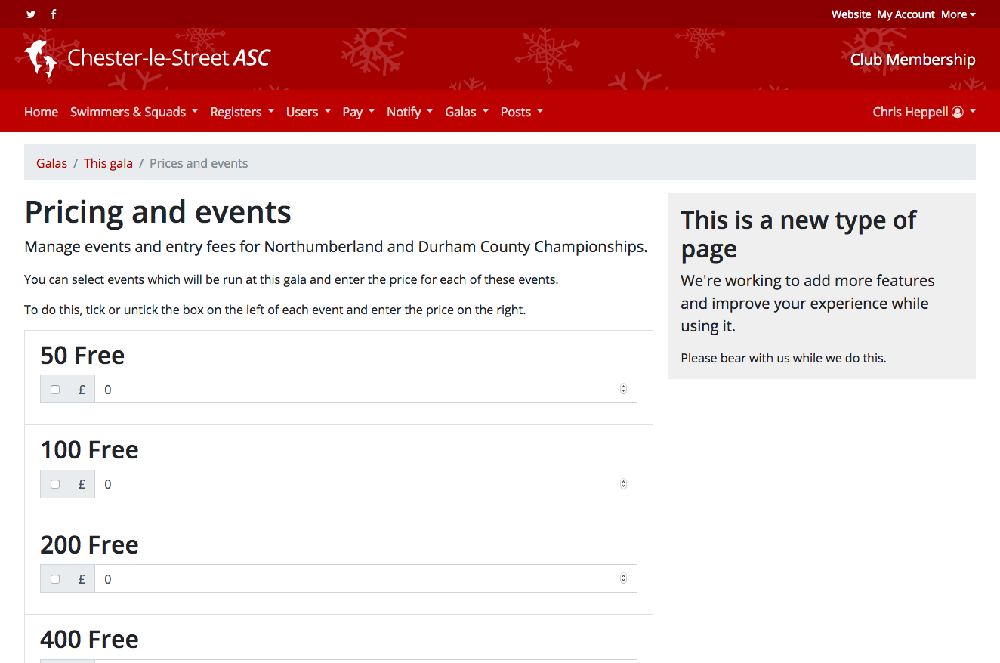
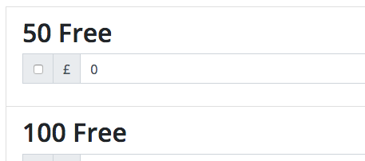
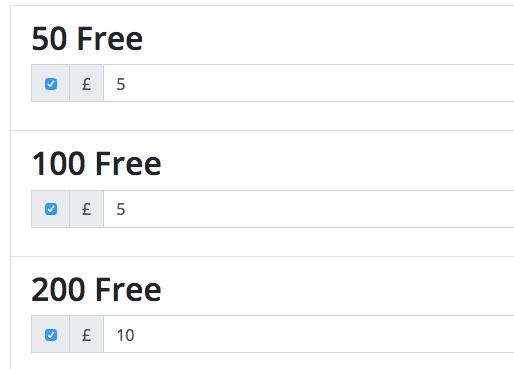
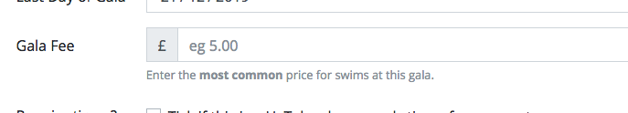

# Migrating to the updated gala system with automatic fee calculation

We're sorry for the inconvenience caused by these changes to how galas are handled in the membership system, however these improvements bring considerable benefits to both you and your users.

Once the update is applied to your system, your parents/users will not be able to make any entries until you have added events and prices for all of your open galas. Existing entries made by parents are not affected though they will not be able to modify any existing entries until events and prices have been added.

These changes means that parents will no longer be able to manually enter the fee for a gala.

This help sheet provides guidance on how to re-enable galas for entries and explains how the system works for future galas. Please note that the look and feel of your membership version may be different to that shown in the images here.

# Re-enabling galas for entries

To re-enable a gala for entries, navigate to the main galas page.

From this page, select the gala you want to re-enable.

You'll be presented with the main information page for the gala. On this page use the *Gala options* dropdown menu in the top right to select *Events and prices*

You'll be taken to a blank *Pricing and events* page for the gala. On this page you'll need to select which events are available at this gala and enter the price for each event.

Make sure you tick the box on the left of the price box to enable an event!

Once you've filled out all the events and prices, save your changes by pressing return or the green *Save* button at the bottom of the page.

# Adding future galas

For all future galas, you'll be asked to enter the most common price on the *Add gala* page. We'll then automatically enable all events and pre-fill the prices.

Once you press *Add gala*, you'll automatically\* be taken to the pricing and events page so that you can disable events and/or change prices for some events.

This should help keep your workload to a minimum while still delivering all the benefits of this update.

\* You won't be automatically redirected to the pricing and events page if you ticked the box to say that this is a *Coach decides entries?* gala. In this case you'll need to manually navigate to the pricing and events page as described in the above section if you wish to edit events or pricing.