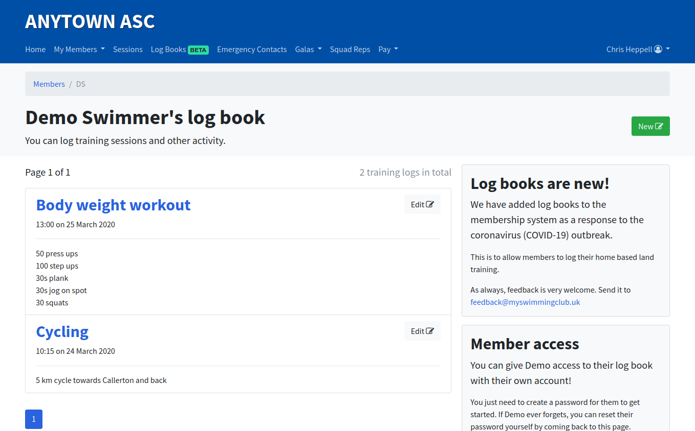

# Editing a log entry

The process for editing a log entry is the same no matter what type of account you hold.

From your log book, find the entry you want to edit and press **Edit** in the top right corner of the log.

You can also view a log entry on its own and can press edit from that page.

You can then edit your log book entry. You can edit all fields;
* Title
* Content
* Date
* Time
* Content type
  * You can use the default type
  * Use a monospaced font
  * or use the Markdown syntax

Press save to save your changes.

You will see a green success message after the entry has been edited.

**Note:** If you back-date a log book entry, it may change position in your log book as they're ordered most-recent first.