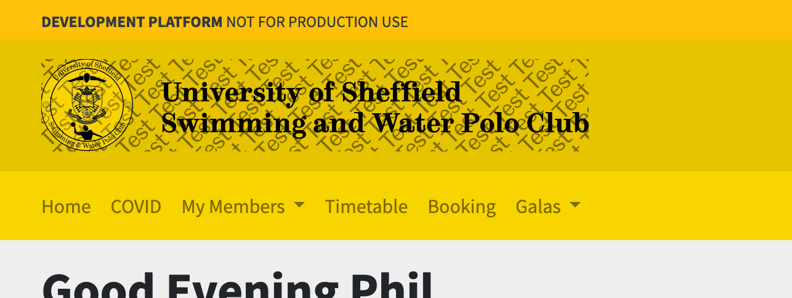
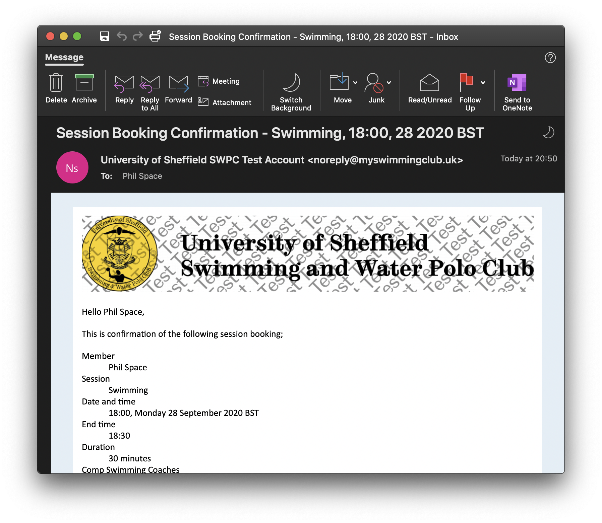

# Booking spaces at training sessions

## Booking a place

To book a place at a training session, please log into your account and select **Timetable** from the main menu.

> **Note** If you are a coach or committee member, select **Timetable** from the **Registers** drop down in the main menu.

You will be presented with a timetable, showing a list of all training sessions for this week.

You can navigate to next week either by changing the date in the **Go to week** field or through the **Previous Week** and **Next Week** buttons.

When you have found a session you want to book a space for, press the green **Book a space** button.

You'll now be shown the booking page for this session. The booking page tells you;

*  Session details such as time, date and location,
*  Total places for this session (if capped)
*  Total places still available (if capped)
*  Places booked

To book your space, press the blue **Book** button next to your name.

We'll show you a confirmation dialog. Press the **Confirm booking** button to confirm your place.

The booking page will update and we will send a confirmation email direct to your email address.

## Cancelling your booking

To cancel your booking, please contact one of your captains. They can remove your booking at their own discretion.

## Changes to sessions

In the event the club needs to reduce the number of spaces available at any given session, one of your captains will edit the number of places available. If more people have booked a place than are now available, those who booked a place most recently will be removed first, up to the new space limit.

If numbers need to be reduced, captains may provide the opportunity for people to give up their place so that others can keep theirs.

## Providing feedback

We've tried to make booking a place at a training session as easy as possible, but this is a new feature in the membership software so feedback is always welcome.

You can provide feedback via;

*  Email [feedback@myswimmingclub.uk](mailto:feedback@myswimmingclub.uk),
*  Call [+44 191 249 4320](tel:+44-191-249-4320) to leave a recorded message.