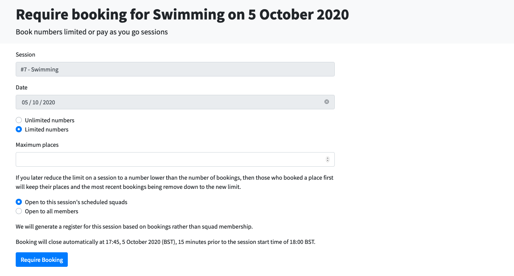
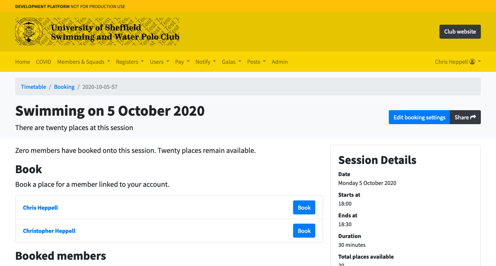
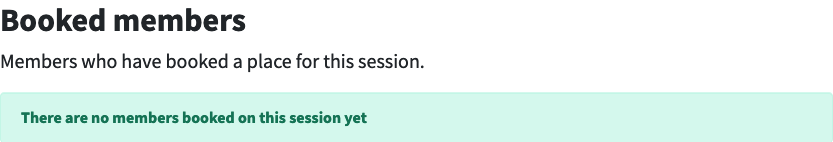
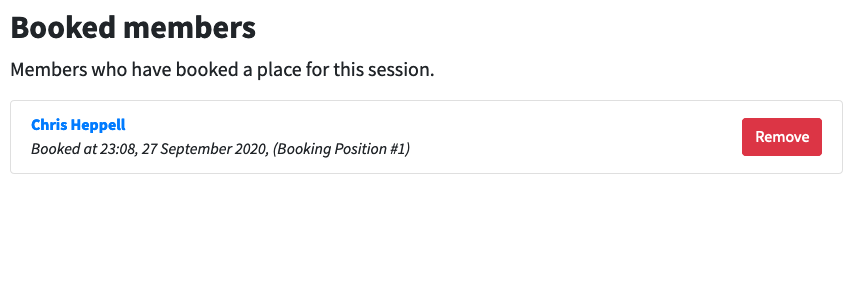
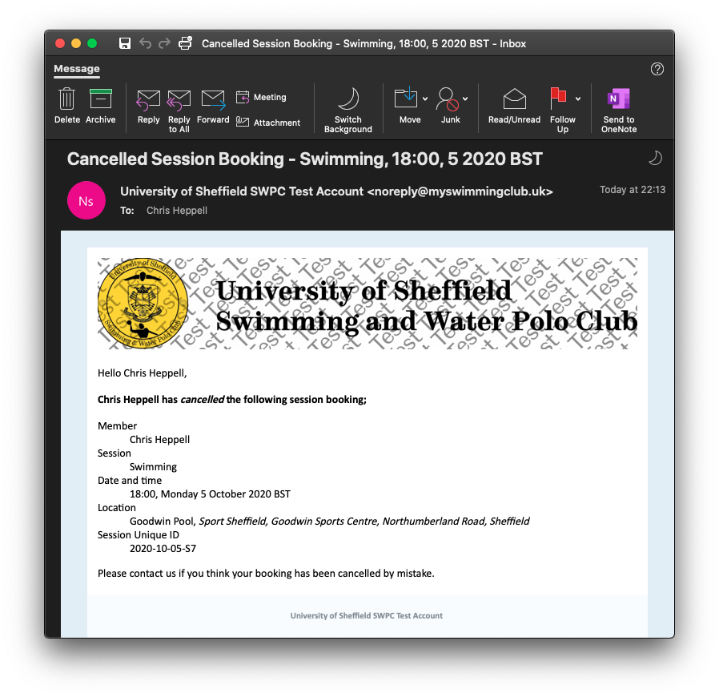

# Managing bookings

> This document details how to require booking for a training session and how to manage those bookings. It is aimed at captains, coaches and other committee members only.

## Requiring Booking

By default, a session does not have to be booked in advance. If a session does not require booking, the register for that session will consist of all members assigned to the sessions squads.

You can require booking for any future session by finding it in the timetable and clicking the blue **Require pre-booking** button.

You will then be presented with a form asking for session details such as;

* Place limits
* Squad options

You can select a limited or unlimited number of places for a session.

By default, we will only open places on the session to members assigned to a squad which is assigned to a session - e.g. to prevent rec or comp swimmers booking a place on the other's session. Select **Open to all members** if instead you want to allow any club members to book a place.

Once you have completed the form, press the blue **Require Booking** button.

## Managing Bookings

Once you've required bookings for a session, we will take you to the booking information page for this session. This is the page other club members also access to book a place, but as an admin you will see more detail.

At the top of the page you'll see the sesison name and two buttons.

* **Edit booking settings**
    * Use this button to edit session booking options such as
        * Max number of places
        * Whether the session is open to all squads or this session's squads
* **Share**
    * Press this link to share a link to the booking page to the Facebook group or anything else. If you share this to the group, members can follow that link to get straight to the booking page.

You'll then also see session details and the booking form. Use this to book your own space on the session, following [the procedure detailed here](booking-a-place.md).

At the bottom you will see a section called **Booked members**. Here you will see a list of members who have booked a space at this session.

Initially, it will be empty.

Once places have been booked, you'll see a list of members like so...

This list tells you;

* Member name
* Booking time
* Booking position - in this example, this is the first person to book a place

You will also spot a big red button that says remove.

To remove a person from a session, press this button. You will then be presented with a confirmation dialog.

Press the red **Cancel booking** button to confirm you want to remove the member from the session. The member will receive an email about this, which will include your name - never lie and say the system did it because they will have your life.

See the example cancel email below...

## Session Registers

The membership system will automatically generate a register for the training session 15 minutes before the session start time. At this moment, booking will close and you can no longer add or remove members.

To access a register

* If the session is current, a link will appear on the main homepage.
* Otherwise select the **Registers** drop down then **Take Register**.

The date will default to today and you should select the session from the drop down menu. To see a previous register, select a different date from the date field and repeat.