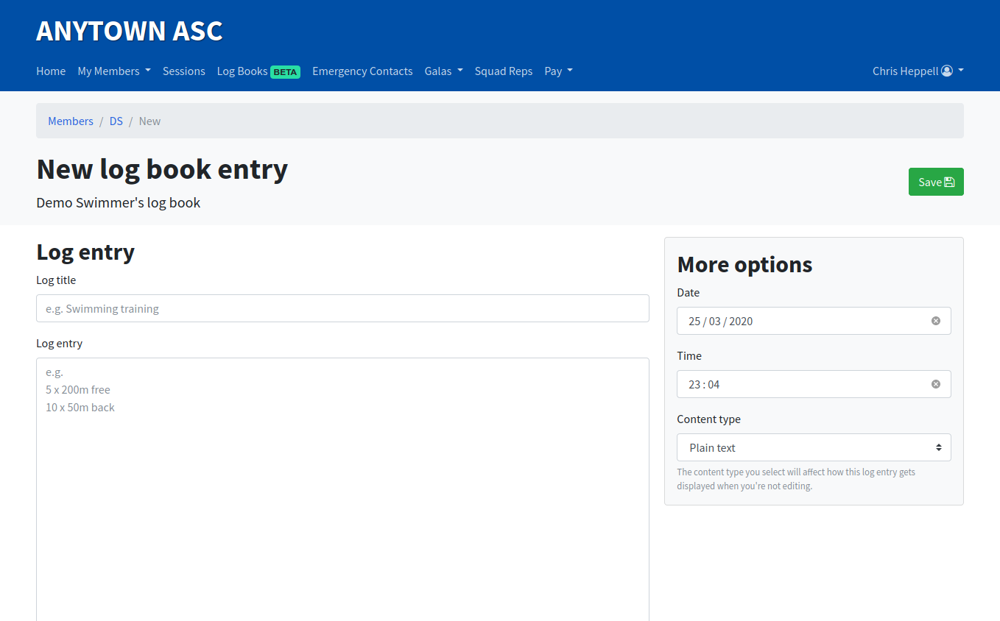
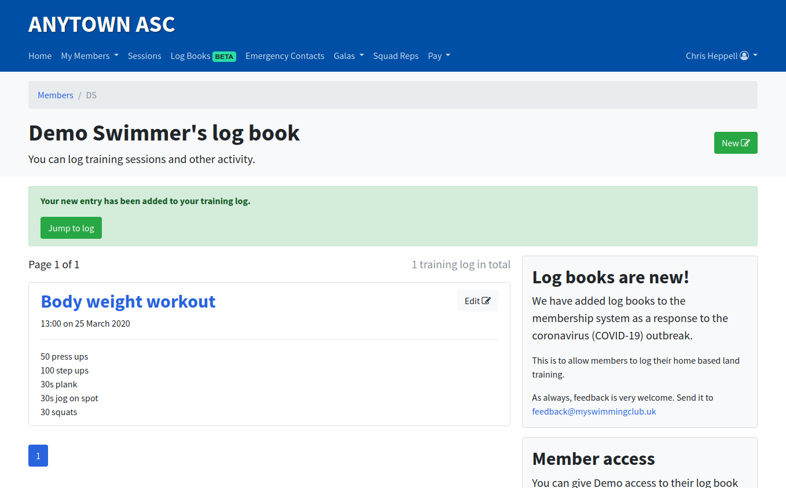

# Adding a log entry

The process for adding a log entry is the same no matter what type of account you hold.

From your log book, press new in the top right corner.

You can then make a log book entry. Enter a title and log content (what you did).

All other fields are optional, but you can use these to set the time and date when you did the activity or you can change the content type to use advanced formatting tools such as [Markdown](https://en.wikipedia.org/wiki/Markdown).

You will see a green success message after the entry has been added.

**Note:** If you back-date a log book entry, it may not appear at the top of the page as log entries are ordered by most-recent first.