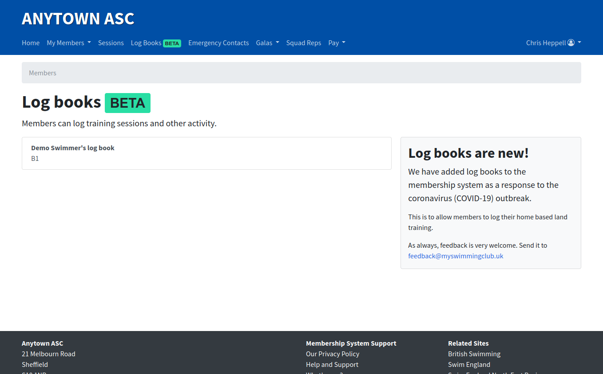

# Finding your log book

## If you have a parent/user account

*If you have a parent/user account, this means you sign in with your email address and password.*

To access your log book(s), sign in to your club account and then select **Log books** from the main menu.

This link is accessible from any page in the membership system.

You will be presented with the log books home page, which shows a list of all members linked to your account.

You're almost there! Now just select the member you want to open their log book.

You can usually expect a log book to be empty when you first open it however club staff such as coaches and view, add to and edit your log book, which means some training could have already been populated.

## If you have a member account

*You have a member account if you sign in using your Swim England (ASA) number and a password. These accounts are usually for swimmers, divers, water polo players who have a parent who holds the main account*

Go to your membership system website on your phone, tablet or computer.

You'll be presented with a page like this.

Now click **Log Books** in the main menu. You'll be presented with a page where you're asked which type of account you want to sign in with.

Select the second option underneath where it says *Are you a member?*.

Now enter your Swim England (ASA) number and your password. If you don't know your password, ask your primary account holder to set one for you.

Your primary account holder can reset your password at any time - there's no need to contact club staff.

Once you've logged in, you'll see all your training logs (if there are any).

You can add or edit any of your entries.

To find out how, read our other guides.