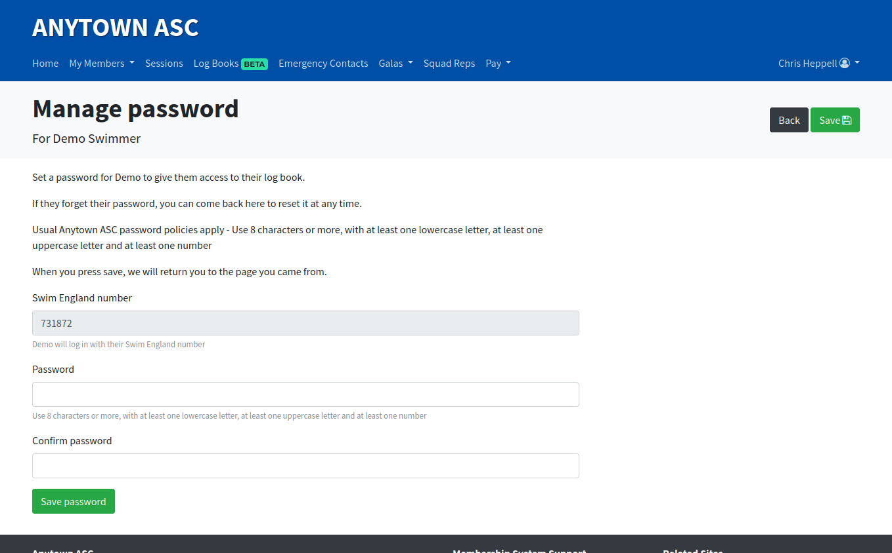

# Setting a password for one of your members

To give your members access to their own log books, you'll need to create a password for each of them.

Begin by navigating to their log book and scroll down to the **Member access** section.

Click on **Password settings**. You'll be presented with a page where you can assign a password.

Follow the on screen intructions to set a password.

As soon as you've set a password your member will be able to sign in. You can repeat this process to reset a password if it is forgotten.

Your member will be able to change their password via their account.