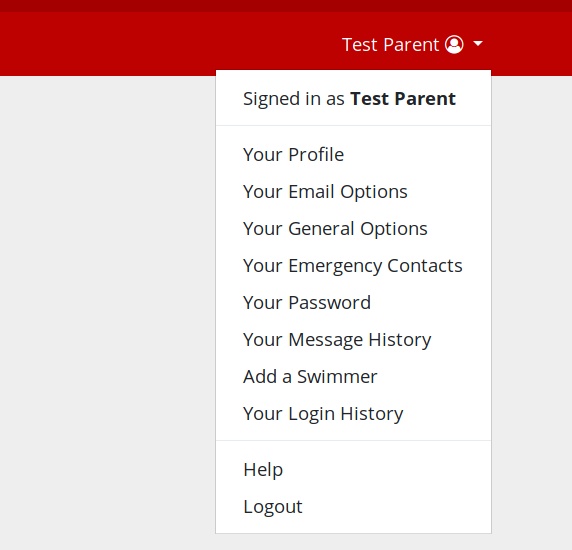
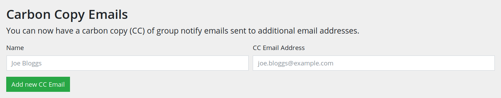

# Adding an additional email address

You can add additional email addresses to your account so that other parents/guardians of your swimmer(s) can also receive the group emails that we send to parents.

These emails may include things like session cancellations and other updates.

> If you add an additional email address, that person will not be able to access your own user account. They will only receive copies of group emails sent to you.

> The person who’s email address you are adding must verify their email address before they will receive emails.

To set up an additional email address first login to your club account then select your name from the main menu at the top of the page and then select "**Your Email Options**".

On the Email Options page find the **Carbon Copy Emails** section.

Enter the name of the person who’s email address you are adding in the **Name** box and enter their email address in the **CC Email Address** box. As soon as you’re done, press the **Add new CC Email** button.

At this point, we will send an email to the email address you have just added. That email will contain a link which they must follow to verify their email address and confirm they wish to receive copies of emails.