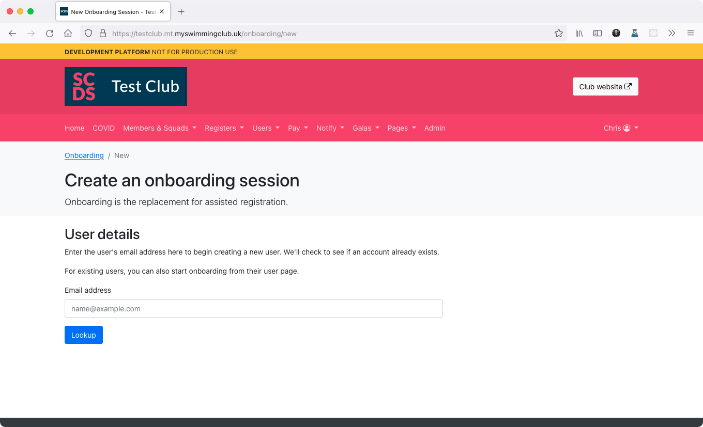
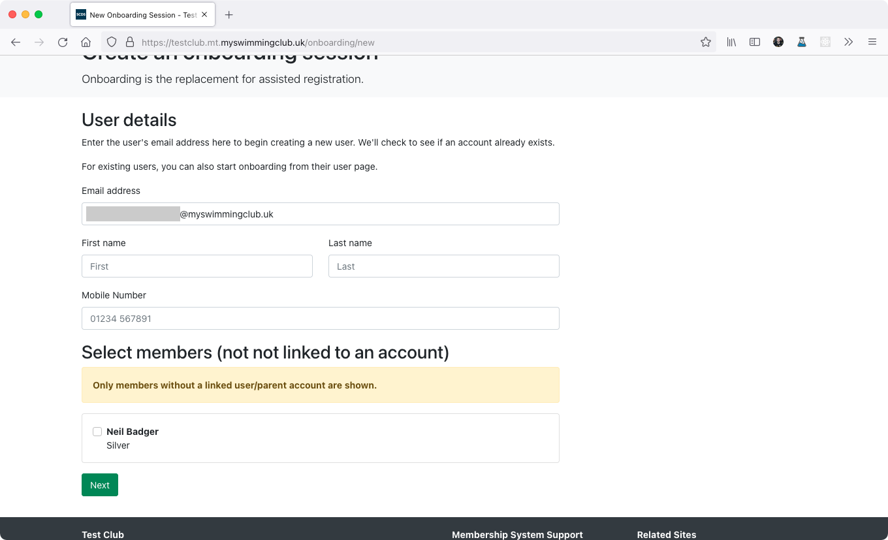
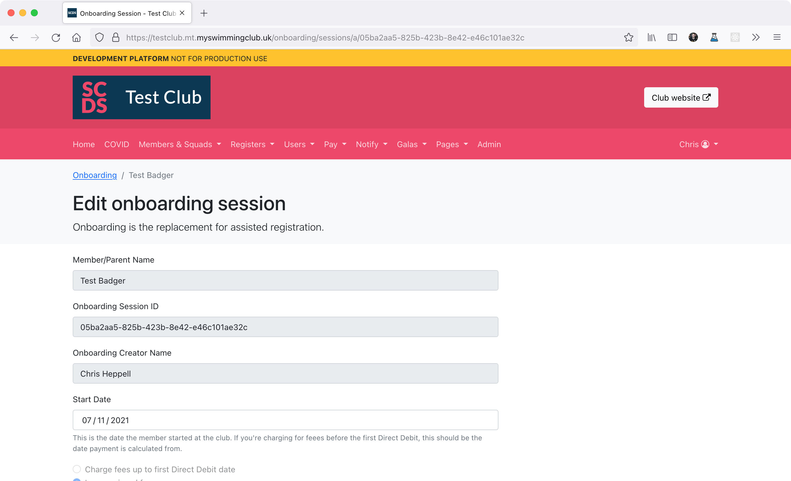
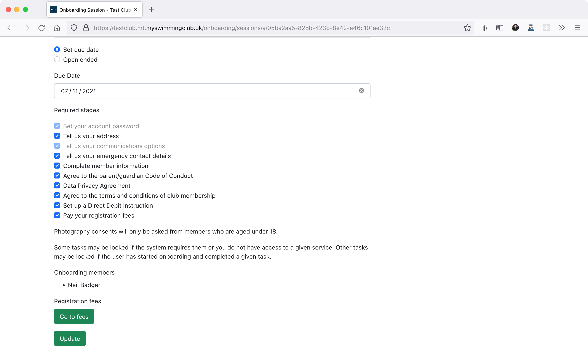
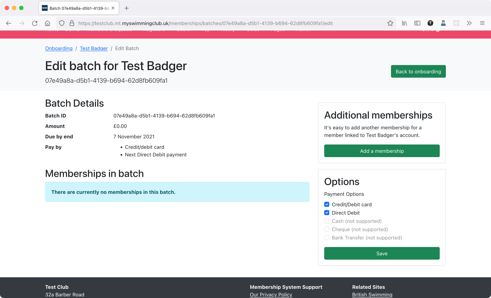
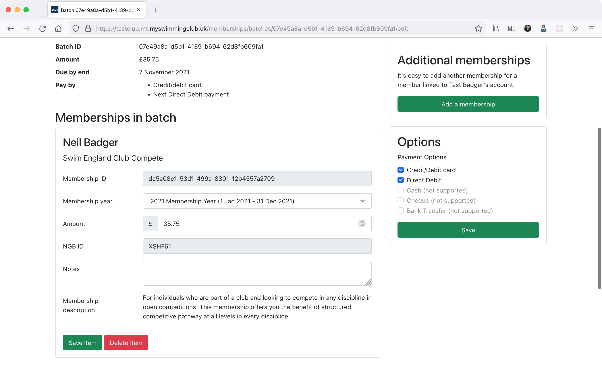

# Onboarding a new member

## About

Onboarding a new member is the process of setting up a new member when they join your club. This may include setting up a brand new user account for that member/parent, or it may involve adding an additional member to an existing account.

Ensuring a positive onboarding experience is hugely important for creating a good impression of the processes emplyed by your club. That's why we've replaced assisted registration with the brand new onboarding tool which has been built from the ground up based on several years of experience working with the assisted registration system.

**Assisted registration will be removed from 1 January 2022. It will not be possible to create a new assisted registration or continue one that has already been created from this date.**

## Major changes compared to the old assisted registration system

Some things have changed - you should be aware of them to avoid any issues.

### Membership fees

In assisted registration, the system tried to automatically calculate appropriate club and Swim England membership fees for each member. The realities are that deciding what to charge a new member is complex as all clubs do thingas differently and may charge different amounts at different times of the year.

As a result, we no longer calculate membership fees automatically. Instead, the person creating the onboarding session for the new member(s) needs to manually choose which memberships to apply to a new member. This person is able to adjust all amounts while doing this.

**If your club applies discounts for club membership fees when there are multiple members in a family, the person creating the onboarding session will need to calculate the appropriate amount themselves. We still apply discounts automatically for membership renewal.**

## Onboarding a new member

We've tried to make the onboarding process as easy as possible for both you and your new member.

Begin by adding new members to the membership system. This step is unchanged from the assisted registration process (note the S.E. transfer checkboxes have been removed).

Then select *Add a user (member onboarding)* from the *Users* dropdown in the main menu. From the onboarding page, select *Get started*.

From here you will be presented with a page which asks you for an email address.

This allows us to work out whether this is a new user or an existing one.

**Note if there are no members to onboard, you will see a warning instead.**

If a user already exists, you can also navigate to their user page and select *Repeat onboarding forms* to prefill their details.

If we find a existing user, we'll prefill their details. Otherwise, we'll ask you to supply a name and mobile number.

Once you have done this, you can select which members to add to this account. In the case of an existing user, you can also select any of their existing members that you want to go through the onboarding forms again.

You'll then be taken to the onboarding details page. Here you can edit more options before we send an email to the user.

At the bottom of the page you can edit the steps the user must go through for registration - some clubs may not need all of the forms.

Scroll down to the bottom of the page and select *Go to fees*.

This will take you to the fee editor.

You'll notice that we no longer charge any membership fees automatically - you'll need to add them manually.

If you plan to charge nothing, please add any memberships required and set the amount for each membership to £0. If you don't need to assign any memberships, just press *Back to onboarding*.

You can then edit any membership fee you have added, or you can remove it.

Don't forget that at this point you may need to edit the supported payment options.

Once you're done, just press *Back to onboarding*.

When we return to the onboarding page, you'll now see an option that says *Send registration email*. Clicking this will send an email to the new user inviting them to complete their forms.