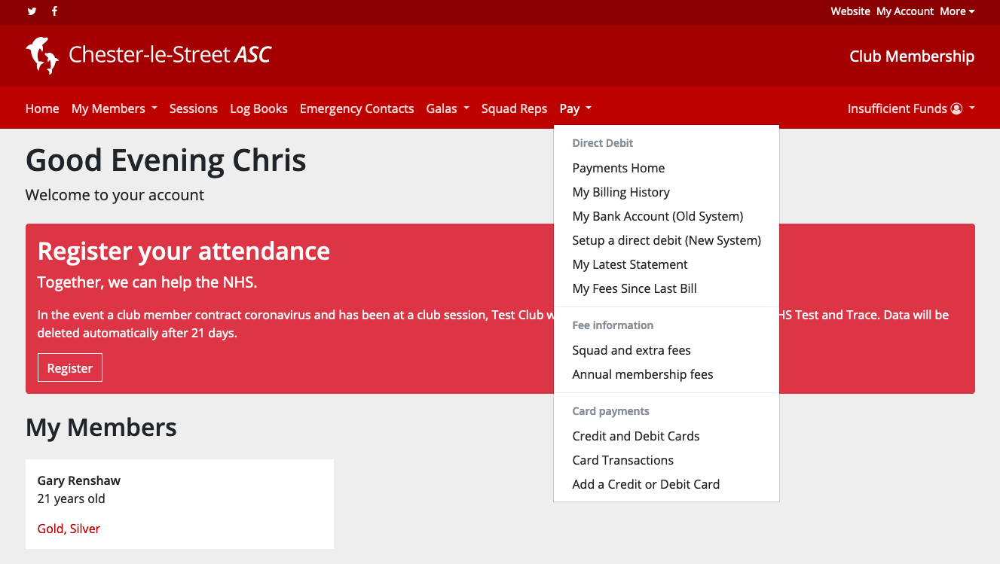
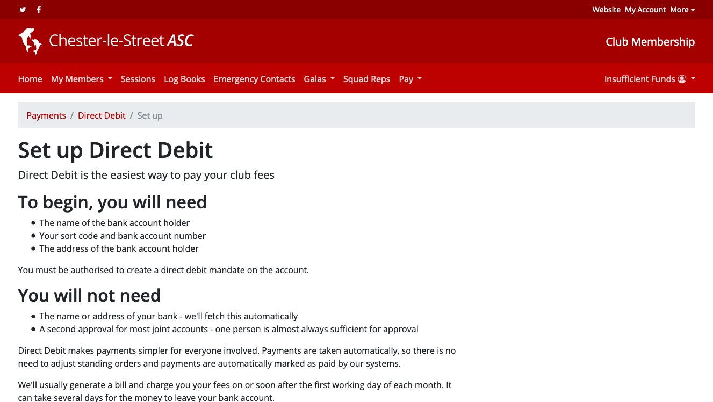
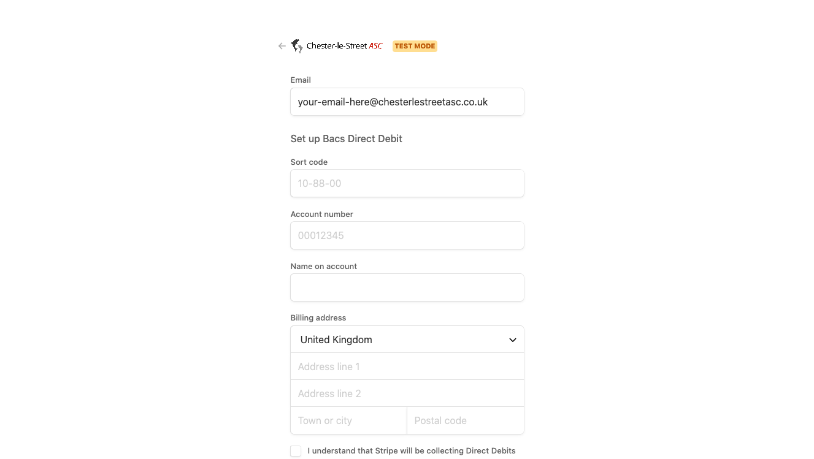

# Direct Debit Transition

## What's happening?

In order to cut costs and to simplify our payments infrastructure, we’re transitioning our BACS Direct Debit service provider from GoCardless to Stripe.

Unfortunately, we’re unable to transfer existing Direct Debit mandates to our new provider. As a result, we’ll need you to set up a new Direct Debit mandate.

We’ll keep charging members via their GoCardless Direct Debit until enough members have set up a mandate with our new provider. Once we hit this threshold, we’ll flick a switch and start charging users via their new mandate.

> Do not cancel your GoCardless Direct Debit Mandate until we tell you we’ve switched to our new provider!

We’ll stop your old GoCardless mandate automatically.

## Setting up your new mandate

Setting up your new mandate is easy.

Log in to your account and select **Pay** from the main menu.

From the **Pay** menu, select **Setup a new direct debit (New System)**.

This will take you to the set up page which tells you a bit more about what you need to do.

On this page, press the **Set Up** button and we’ll take you to a form on our partner’s website to collect your details.

They will collect your email, name, bank details and address.

After that, follow the on screen instructions and you’re all done.