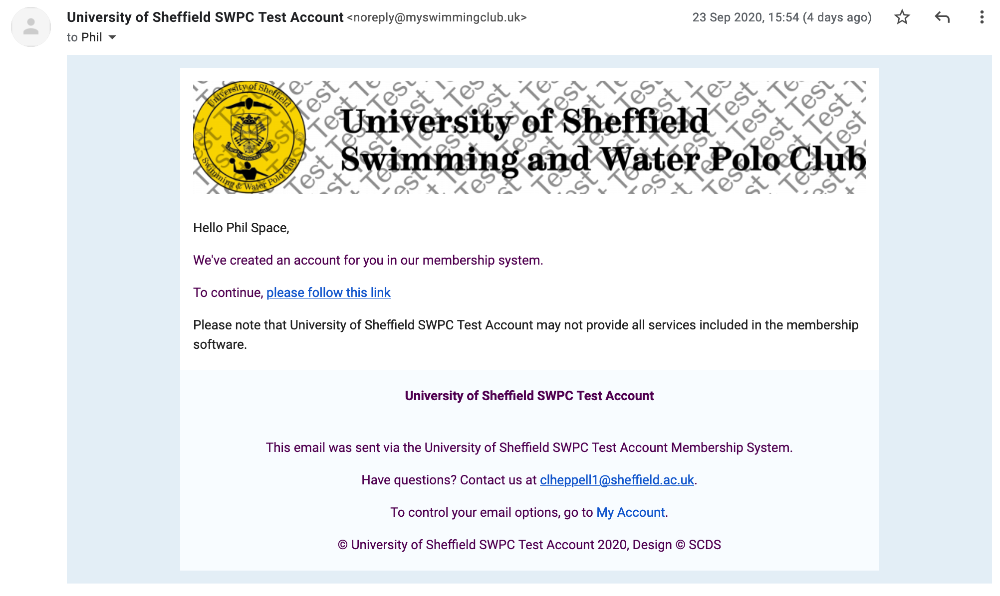
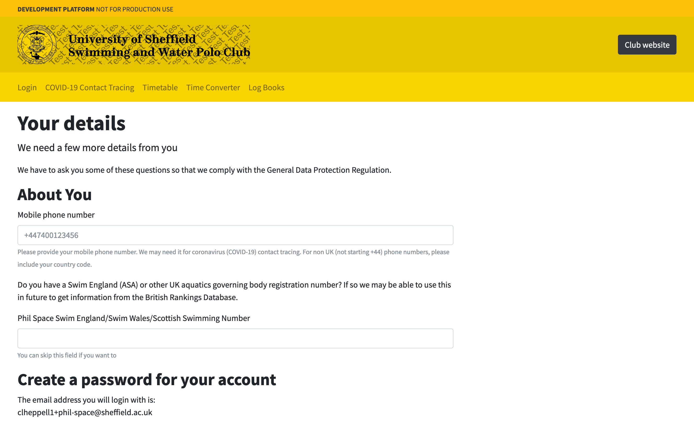

# Completing registration for your account

## Getting Started

After you join the club for 2020-21 via the Sport Sheffield website, the club will create a new account for you. You will be sent an email by the system with instructions on how to complete registration.

Follow the link in the email to complete registration.

At this point, we'll need to ask you for a few details that weren't provided to us by Sport Sheffield.

In this step we will ask you to;

*  Tell us your mobile number (for COVID-19 contact tracing purposes)
    * By default we will assume numbers are UK phone numbers. If they are not, please include your country code.}
*  If you have one, tell us your Swim England/Swim Wales/Scottish Swimming NGB Registration Number
    * Check if you have one at https://www.swimmingresults.org/biogs/
*  Create a password for your account
*  Tell us your communication preferences
    * The club will still be using the Facebook group for communications, it's just mandatory that the software asks you this because of GDPR.
*  Agree to the privacy policy

If everything is correct, we'll log you straight into your account. If not, the system will prompt you to correct any invalid details.

You will be able to log onto this account at https://myswimmingclub.uk using your email address and password.